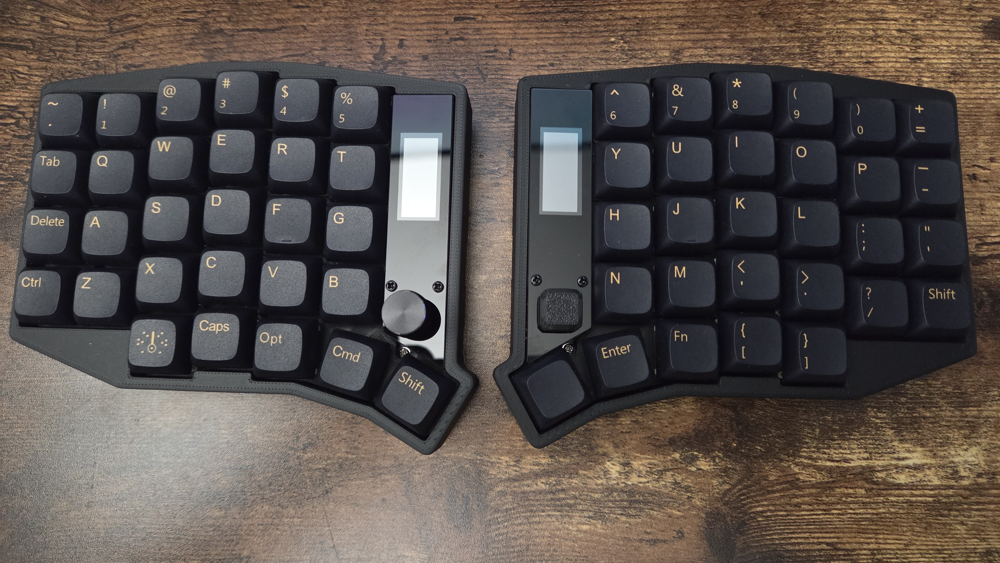
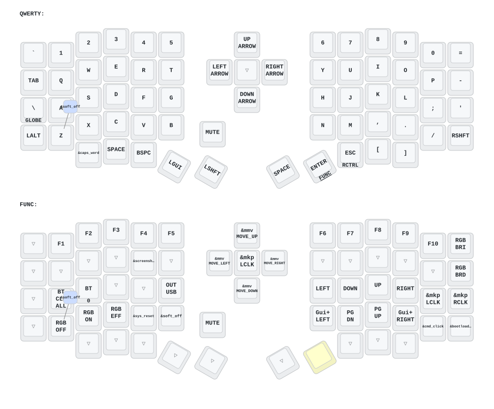

# (Eyelash Peripherals) Sofle ZMK Repository

## Components

1. Pre-soldered PCB and case - from [AliExpress Highland 3C Store](https://www.aliexpress.us/item/3256808969391004.html)
2. ZhouWang Golden Autumn Silent Tactile Switch - from [Amazon](https://www.amazon.com/dp/B0GQT23BJZ)
3. XDAL DSA Keycaps - from [AliExpress](https://www.aliexpress.us/item/3256803108650035.html)

For 3D printed model files or keyboard hardware issues, contact `380465425@qq.com`.



## Keymap Diagram Generation (Local)

Generate keymap diagrams locally to validate syntax before pushing.

### One-time setup

```bash
python3 -m venv .venv
source .venv/bin/activate
pip install keymap-drawer
```

### Parse and draw

```bash
source .venv/bin/activate
keymap parse -z config/eyelash_sofle.keymap > keymap-drawer/eyelash_sofle.yaml
keymap -c keymap_drawer.config.yaml draw keymap-drawer/eyelash_sofle.yaml > keymap-drawer/eyelash_sofle.svg
```

Parsing catches syntax errors faster than a full firmware build.

### Quick remapping via ZMK Studio (NOT RECOMMENDED)

For simple key binding changes, connect the left half via USB-C and open [ZMK Studio](https://zmk.studio/) in Chrome/Edge. Changes are applied live over USB — no tools or network access required.

DO NOT attempt this if you plan to flash your own firmware. As mentioned below, ZMK Studio changes are applied on top of firmware changes, and there's no good way to visualize / maintain the layout. It's better to always edit keymap and flash firmware instead.

## Firmware Build (GitHub Actions)

Firmware is compiled via GitHub Actions — local builds require a full [Zephyr SDK](https://docs.zephyrproject.org/latest/develop/getting_started/index.html) and ARM toolchain which are not included in this repo.

1. Push your changes to GitHub.
2. [Ensure the Actions workflow is enabled](https://docs.github.com/en/actions/managing-workflow-runs-and-deployments/managing-workflow-runs/disabling-and-enabling-a-workflow#enabling-a-workflow).
3. Download the `.uf2` firmware artifacts from the completed workflow run. The build produces three files:
   - `eyelash_sofle_left` — left half (with ZMK Studio support)
   - `eyelash_sofle_right` — right half
   - `nice_nano_v2_settings_reset` — settings reset utility (see below)
4. Flash each half:
   1. Keep the power switch **ON**.
   2. **Double-tap the reset button** — the board enters bootloader mode and appears as a USB drive.
   3. Drag the correct `.uf2` file onto the drive. It flashes and reboots automatically.
   4. Repeat for the other half.

### Settings Reset

Flash `nice_nano_v2_settings_reset.uf2` to clear stored bonds, ZMK Studio overrides, and other saved settings. You'll need this when:

- **One half stops sending keypresses** — the BLE bond between halves is broken (most common after flashing new firmware to only one side).
- **Keys produce wrong output after a keymap change** — stale ZMK Studio overrides persist in flash and take priority over the compiled keymap.
- **Halves won't pair with each other or the host** — bond table is full or corrupted.

To reset:
1. Flash `nice_nano_v2_settings_reset.uf2` to the **right** half.
2. Flash `eyelash_sofle_right` firmware to the **right** half.
3. Flash `nice_nano_v2_settings_reset.uf2` to the **left** half.
4. Flash `eyelash_sofle_left` firmware to the **left** half.
5. Power cycle both halves (toggle power switch off, wait 5 seconds, toggle on). They will re-pair automatically.

> **Why right first?** The left half is the BLE central — it initiates connections. If the left half boots with fresh bonds before the right half is reset, it may not discover the right half. Resetting and flashing the right (peripheral) first ensures it's ready to be found when the left half comes up.

### Troubleshooting

**Right half powered on but no keypresses registered:**
The right half connects to the left half over BLE, not directly to the host. A lit display or RGB only confirms power — not a working BLE link. Try these steps in order:

1. **Power cycle both halves** — toggle both power switches off, wait 5 seconds, toggle both on simultaneously.
2. **Check the left half's display** — if it doesn't show a peripheral connection indicator, the halves aren't bonded.
3. **Move the halves close together** — keep them touching during initial pairing; some boards have weak BLE signal on first boot.
4. **Verify correct firmware** — confirm you flashed `eyelash_sofle_right` (not left) to the right half.
5. **Full settings reset** — follow the reset procedure above (right half first, then left).

**Keys produce wrong output after a keymap change:**
ZMK Studio overrides persist in flash and take priority over the compiled keymap. Connect the left half via USB-C, open [ZMK Studio](https://zmk.studio/), and check for stale overrides — or do a full settings reset.

**Keyboard won't connect to host computer via Bluetooth:**
Press `BT_CLR_ALL` (Layer 1, leftmost key on the home row) to clear all host Bluetooth bonds, then re-pair from your computer's Bluetooth settings.

## Changelog

1. **2026/06/22** — Keyboard now supports key remapping via DYA STUDIO (cormoran ZMK fork). Chinese users can contact the seller for the Chinese DYA STUDIO installer.
2. **2025/08/22** — Added soft off (Q+S+Z held 2s enters deep sleep). Updated ultra-thin case designs. Removed GIF animations on right half display to reduce power consumption.
3. **2024/12/21** — Added ZMK Studio support (left half only).
4. **2024/10/24** — Improved power supply mode, reduced power consumption. Fixed RGB power auto-off.

> If you updated your firmware before 2025/08/22, please update to the latest firmware.

## Keymap Diagram



_generated by @caksoylar's Keymap Drawer_
